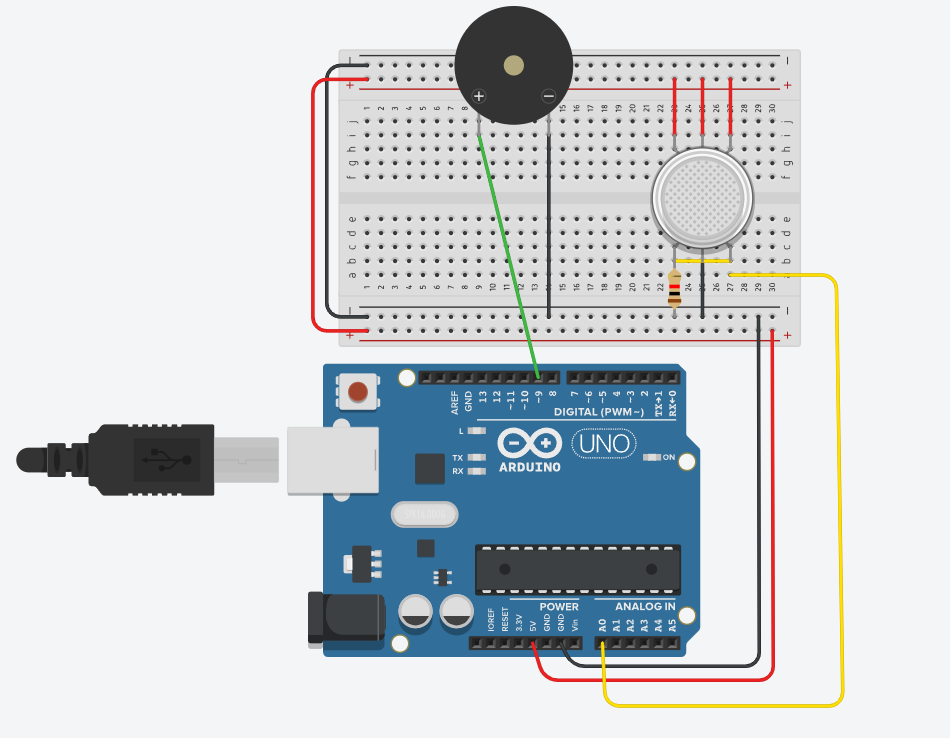
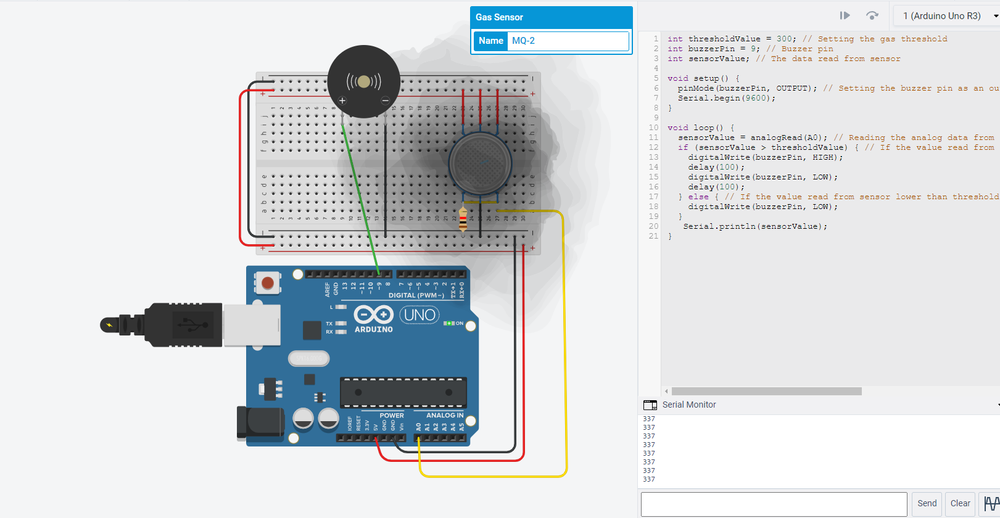
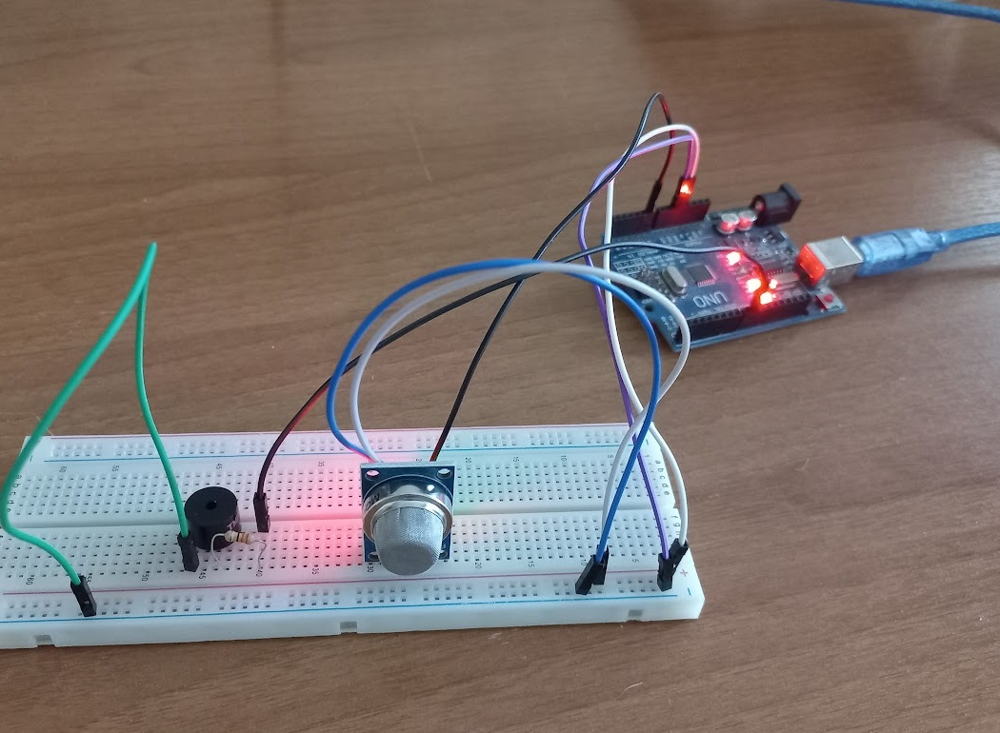
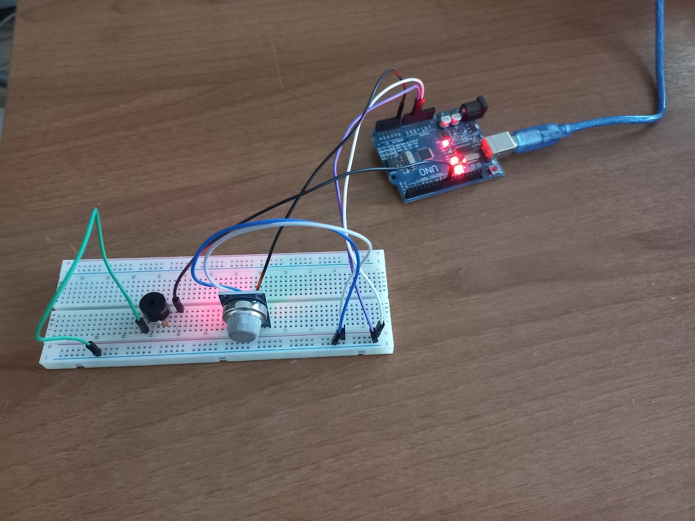

# Project summary

There is a unit in a chemical factory that contains chemical gases (LPG, CO etc.) that can be poisonous. This project is the ventilation automation project for this unit.

# The purpose of the project:
To create an automation application that will activate the ventilation evacuation system when dangerous conditions occur and disable the ventilation evacuation system when dangerous conditions are eliminated.

# How the project works:
Transfer the data from the MQ-2 Gas sensor via Arduino to the LabView program via serial communication, process this data in the LabView program. The operation is as follows;
- Make continuous measurement, if the obtained LPG data is more than 400 PPM, activate the threshold value warning LED.
- Afterwards, a loud warning sound will be made with the buzzer element for critical situation warning.
- Then print the "The ventilation system for evacuation has been activated because the threshold value has been exceeded." warning.
- Measure again and repeat the steps.

# Used materials:
- 1 x Arduino UNO
- 1 x Breadboard
- 1 x MQ-2 Gas Sensor
- 1 x Buzzer
- 1 x 330Ω Resistor
- 1 x 40 Pin Detachable Female-Male Jumper Cable
- 1 x 40 Pin Detachable Male-Male Jumper Cable

# Photos
- A circuit schematic drawn on TinkerCAD

- When the sensor value bigger than threshold value

- The circuit on breadboard (When the sensor value lower than threshold value)

- The circuit on breadboard (When the sensor value bigger than threshold value)
